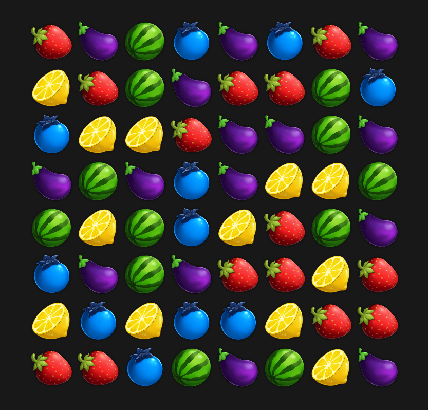

# Sample Match-3 RL Environment

This repository contains a sample match-3 game RL environment. The environment is developed using [Unity](https://unity.com/) game engine and [Unity ML-Agents](https://github.com/Unity-Technologies/ml-agents).

The environment can either be used as a Unity ML-Agents environment or as a Gym environment using wrappers.

The environment reward can be configured using a configurating file. The objective of this environment is to maximize the number of matches in limited number of actions which in this case is 15 actions.

## Requirements

Windows machine with python 3.7 or newer installed. The environment is provided as a windows binary so it can not run on other operating systems.

## Configuration

Inside Build folder, there is a file titled *config.json*. Only one field, **RewardMode** exists which can take following values:
- 0 : Immediate match reward. Does not containg reward from gravity and cascaded matches.
- 1 : Cascade mode. Does not contain immediate reward. Contains reward gained due to gravity and cascaded matches.
- 2 : Total mode. Total reward gained 

## How to use?

1) Create a python virtual environment. (Optional but recommended)
2) Install required packages using *requirements.txt* file.
3) Investigate **random_agent.py** file as an example of how to use this environment.

There is a custom Unity to Gym environment wrapper inside *lib* folder, which only differs from Unity's official wrapper in **reset** method. Custom wrapper's **reset** returns two values : (state,action_mask)

Match-3 board size is 8x8 with 5 tile types(colors). The state is 6 binary planes. Layers 1-5 marks each color type in binary. Layer 6 marks tiles that can be part of a valid move.

Good Luck!

